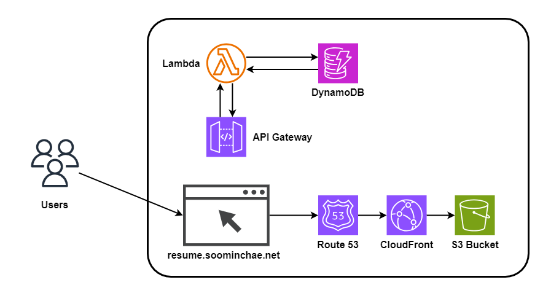

# AWS Cloud Resume Challenge
This is my attempt of the [cloud resume challenge in AWS](https://cloudresumechallenge.dev/docs/the-challenge/aws/). It is a static website of my resume hosted on AWS using its various services. 

# Architecture

# Tech Stacks
- S3
- CloudFront
- Certificate Manager
- API Gateway
- Lambda
- Dynamo DB

# Unique Features
1. API Gateway

The original challenge did not include the API Gateway to invoke the Lambda function. However, Lambda function invoke URL does not work in ap-northeast-2. In order to resolve this, I added an API Gateway to invoke the Lambda function.
